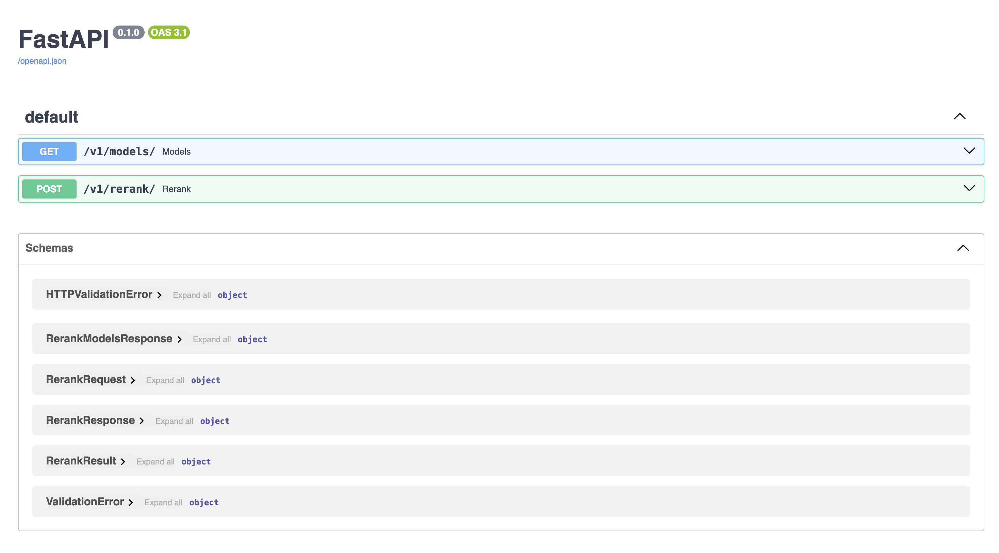

# Peanut Shell


`Peanut Shell` is a reranking service for better RAG performance. The models supported are from [CrossEncoder](https://huggingface.co/cross-encoder).

Check out the models supported so far:

- ms-marco-TinyBERT-L-2-v2
- ms-marco-MiniLM-L-2-v2
- ms-marco-MiniLM-L-4-v2
- ms-marco-MiniLM-L-6-v2
- ms-marco-MiniLM-L-12-v2
- ms-marco-TinyBERT-L-2
- ms-marco-TinyBERT-L-4
- ms-marco-TinyBERT-L-6
- ms-marco-electra-base

For more details, please refer to the models table on [cross-encoder/ms-marco-MiniLM-L-6-v2](https://huggingface.co/cross-encoder/ms-marco-MiniLM-L-6-v2).

## User Guide

It's recommended to run `Peanut Shell` as a docker container.

### How to install

Use the commands below to clone this repo and run the docker container.

```shell
$ git clone git@github.com:sugarforever/peanut-shell.git
$ cd peanut-shell
$ docker compose up -d
```

### How to use

There are 2 APIs available. Refer to the example below on how to make API call.

#### List supported models

```shell
curl --location 'http://localhost:8000/v1/models'
```

Expected response

```json
{
    "models": [
        "ms-marco-TinyBERT-L-2-v2",
        "ms-marco-MiniLM-L-2-v2",
        "ms-marco-MiniLM-L-4-v2",
        "ms-marco-MiniLM-L-6-v2",
        "ms-marco-MiniLM-L-12-v2",
        "ms-marco-TinyBERT-L-2",
        "ms-marco-TinyBERT-L-4",
        "ms-marco-TinyBERT-L-6",
        "ms-marco-electra-base"
    ]
}
```

#### Rerank documents

```shell
curl --location 'http://localhost:8000/v1/rerank/' \
--header 'Content-Type: application/json' \
--data '{
    "model": "ms-marco-MiniLM-L-6-v2",
    "query": "What is the capital of the United States?",
    "top_n": 3,
    "documents": [
        "Carson City is the capital city of the American state of Nevada.",
        "The Commonwealth of the Northern Mariana Islands is a group of islands in the Pacific Ocean. Its capital is Saipan.",
        "Washington, D.C. (also known as simply Washington or D.C., and officially as the District of Columbia) is the capital of the United States. It is a federal district.",
        "Capital punishment (the death penalty) has existed in the United States since beforethe United States was a country. As of 2017, capital punishment is legal in 30 of the 50 states."
    ]
}'
```

You should expect similar response as below:

```json
{
    "results": [
        {
            "index": 2,
            "relevance_score": 8.186723709106445
        },
        {
            "index": 3,
            "relevance_score": 0.2271757274866104
        },
        {
            "index": 0,
            "relevance_score": -2.0371546745300293
        }
    ]
}
```

## API Documentation

When you launch the API on localhost, you should be able to view the API documentation on [http://localhost:8000/docs](http://localhost:8000/docs).

